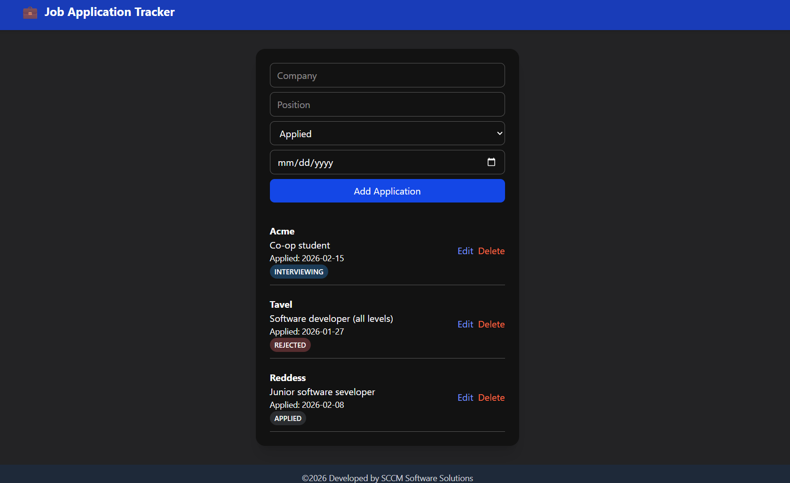
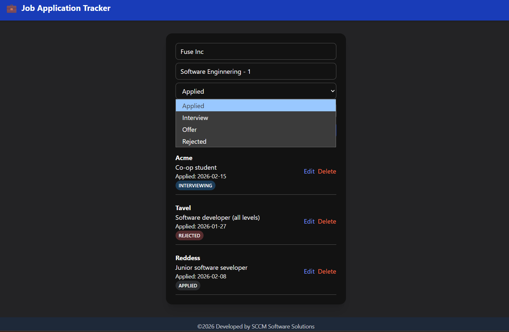
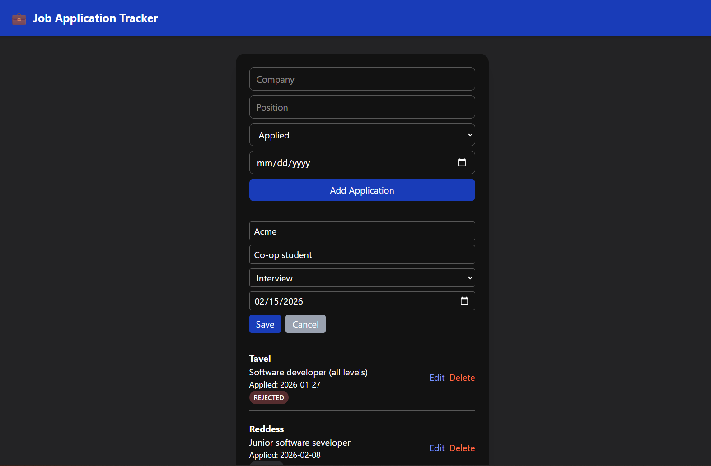

# 💼 Job Application Tracker

I built a full-stack web application that helps users track and manage their job applications throughout the hiring process. Now it's easier for me to keep track of my job hunting process. Hope it can help other people in the same situation.

Built with **Spring Boot, MySQL, React, TypeScript, and Tailwind CSS.**

---

## Features

- Create new job applications
- Edit company, position, status, and applied date
- Delete applications
- Status tracking (APPLIED, INTERVIEW, OFFER, REJECTED)
- RESTful API built with Spring Boot
- MySQL database integration
- Environment variable configuration (`VITE_API_URL`)
- Error handling and loading states
- Responsive UI using Tailwind CSS

---

## Tech Stack

### Backend

- Java
- Spring Boot
- Spring Data JPA
- MySQL
- REST API architecture

### Frontend

- React
- TypeScript
- Vite
- Tailwind CSS
- Fetch API

---

## Architecture Overview

The application follows a typical full-stack architecture:

Frontend (React)  
⬇  
REST API (Spring Boot)  
⬇  
MySQL Database

The frontend communicates with the backend using a configurable environment variable:

VITE_API_URL

This allows independent deployment of frontend and backend.

---

## Project Structure

### Backend

src/main/java/
├── controller
├── repository
├── entity
├── enum

### Frontend

src/
├── components
├── pages
├── types

---

## Environment Variables

Create a `.env` file in the frontend root directory:

VITE_API_URL=http://localhost:8080/api

For production:

VITE_API_URL=https://your-backend-url/api

---

## ▶️ Running Locally

### 1️⃣ Backend

Make sure MySQL is running.

Update your `application.properties`:

spring.datasource.url=jdbc:mysql://localhost:3306/jobtracker  
spring.datasource.username=your_username  
spring.datasource.password=your_password  
spring.jpa.hibernate.ddl-auto=update

Run the backend:

mvn spring-boot:run

Backend will run at:

http://localhost:8080

---

### 2️⃣ Frontend

Install dependencies:

npm install

Start development server:

npm run dev

Frontend will run at:

http://localhost:5173

---

## API Endpoints

GET /api/applications → Get all applications  
POST /api/applications → Create new application  
PUT /api/applications/{id} → Update application  
DELETE /api/applications/{id} → Delete application

---

## Example Request Body (POST)

{
"company": "Google",
"position": "Frontend Developer",
"status": "APPLIED",
"appliedDate": "2026-02-15"
}

---

## Future Improvements

- User authentication (JWT)
- Filtering by status
- Dashboard analytics
- Pagination
- User-specific application tracking

---

## What I Learned

- Designing RESTful APIs with Spring Boot
- Connecting React to a backend using environment variables
- Managing state with TypeScript
- Handling asynchronous operations and error states
- Structuring full-stack applications for deployment

---
